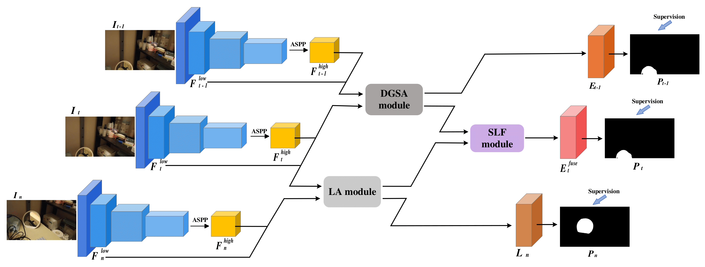

# Fusion of Short-term and Long-term Attention for Video Mirror Detection (ICME Oral 2024)

Mingchen Xu, Yukun Lai, Ze Ji, Jing Wu

School of Computer Science and Informatics, Cardiff University


<p align="center">
  
</p>


## Requirement

cuda==11.1   
cudnn==8.0  
torch==1.9.0   
timm==0.9.6   
transformers==4.30.2   
pytorch-lightning==1.5.10  
medpy==0.4.0  
einops==0.6.1


## Usage Instructions

1. **Setup**

   Clone the repository and navigate to its directory:

   ```shell
   git clone https://github.com/UpChen/2024_FusionNet.git
   cd 2024_FusionNet
   ```
   
2. **Dataset Preparation**

   Download and unzip [ViMirr dataset](https://drive.google.com/file/d/1NO8uO6AALmI1Bh3UUh68tx1POHyC6O2i/view?usp=drive_link)).
   
4. **Training**
   
   To train the model, execute:
    
   ```shell
   python train.py
   ```
   
6. **Testing**

   After training, update the checkpoint file path in the infer.py script. Then, test the trained model using:
   
   ```shell
   python infer.py
   ```
   
## Citation

If you use this code or the associated paper in your work, please cite:
   
```
@INPROCEEDINGS {10688367,
author = {M. Xu and J. Wu and Y. Lai and Z. Ji},
booktitle = {2024 IEEE International Conference on Multimedia and Expo (ICME)},
title = {Fusion of Short-term and Long-term Attention for Video Mirror Detection},
year = {2024},
volume = {},
issn = {},
pages = {1-9},
abstract = {Techniques for detecting mirrors from static images have witnessed rapid growth in recent years. However, these methods detect mirrors from single input images. Detecting mirrors from video requires further consideration of temporal consistency between frames. We observe that humans can recognize mirror candidates, from just one or two frames, based on their appearance (e.g. shape, color). However, to ensure that the candidate is indeed a mirror (not a picture or a window), we often need to observe more frames for a global view. This observation motivates us to detect mirrors by fusing appearance features extracted from a short-term attention module and context information extracted from a long-term attention module. To evaluate the performance, we build a challenging benchmark dataset of 19,255 frames from 281 videos. Experimental results demonstrate that our method achieves state-of-the-art performance on the benchmark dataset.},
keywords = {shape;image color analysis;streaming media;benchmark testing;feature extraction;transformers;real-time systems;mirrors;data mining},
doi = {10.1109/ICME57554.2024.10688367},
url = {https://doi.ieeecomputersociety.org/10.1109/ICME57554.2024.10688367},
publisher = {IEEE Computer Society},
address = {Los Alamitos, CA, USA},
month = {jul}
}
```

### Contact
If you have any questions, please feel free to contact me via `xum35@cardiff.ac.uk`.


